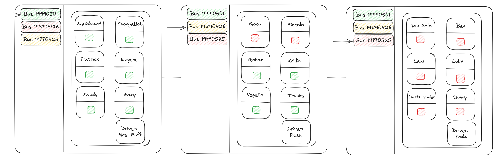

# Bus Tracker 🚌

## Project Overview

A tracking application for teachers to ensure all students are accounted for during bus duty.

### Learning Goal:

- The goal of this project was to prepare me for learning React.js by reinforcing skills for JavaScript/HTML/CSS and introducing the JavaScript ES6 support.

### Installation

- This project can run smoothly in any [live code server](https://marketplace.visualstudio.com/items?itemName=ritwickdey.LiveServer) supported by an IDE or directly in your web browser from *localhost*.

# Design

## Wireframes

## Functionality

1. Software displays all busses and their capacity status
2. Software displays all students and driver for a selected bus
3. Software displays a student name and attendence-status
4. User updates student from absent to present
5. User updates student from present to absent
6. Software updates capacity status to full when all students are present
7. Software updates capacity status to partial when some students are present
8. Software updates capacity status to empty when no students are present
9. User creates new bus with new id and driver
10. User add students to bus with name

## OOP Design

- Bus
    - busId (String)
    - capacity (String) - (EMPTY, PARTIAL, FULL)
    - driver (String)
    - students (Student Array)
- Student
    - name (String)
    - isPresent (boolean)
